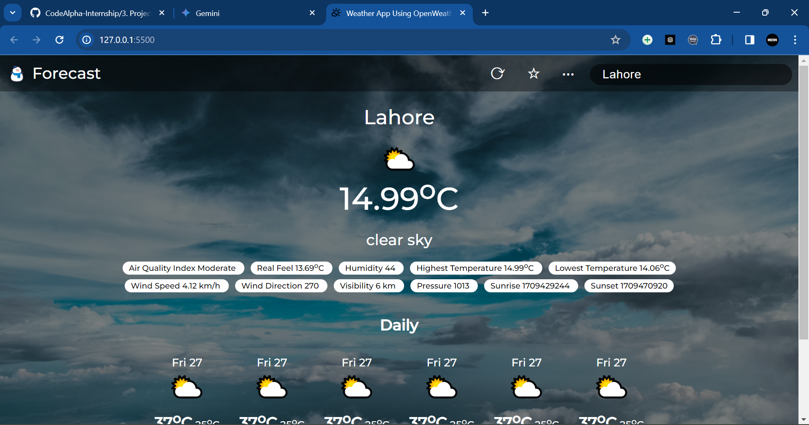
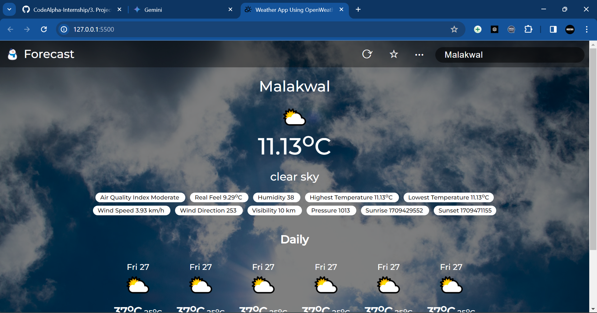

## Weather App (OpenWeatherMap API - Vanilla JavaScript)

This project is a weather application built using Html, Css, JavaScript and the OpenWeatherMap API. It provides users with a detailed view of current weather conditions and forecasts, going beyond just temperature.

**Key Features**

- **Current Temperature:** Get the current temperature in your location.
- **Advanced Weather Data:**  In addition to temperature, the app displays various weather metrics, including:
    - Air Quality Index
    - Real Feel
    - Humidity
    - High and Low Temperatures
    - Wind Speed and Direction
    - Visibility
    - Pressure
    - Sunrise and Sunset Times

**User Interface**

The application features a clean and intuitive interface, as showcased in the provided screenshots (descriptions not shown here for brevity). 

**Technical Details**

- **Development Framework:** HTML, CSS, Vanilla JavaScript (without external libraries)
- **Data Source:** OpenWeatherMap API
- **Configurability:** The app utilizes an API key for authentication.  Instructions are provided for obtaining a free API key from OpenWeatherMap and integrating it into the project.

**Overall, this weather application offers a comprehensive and user-friendly way to access real-time weather information.**

## Screenshots

